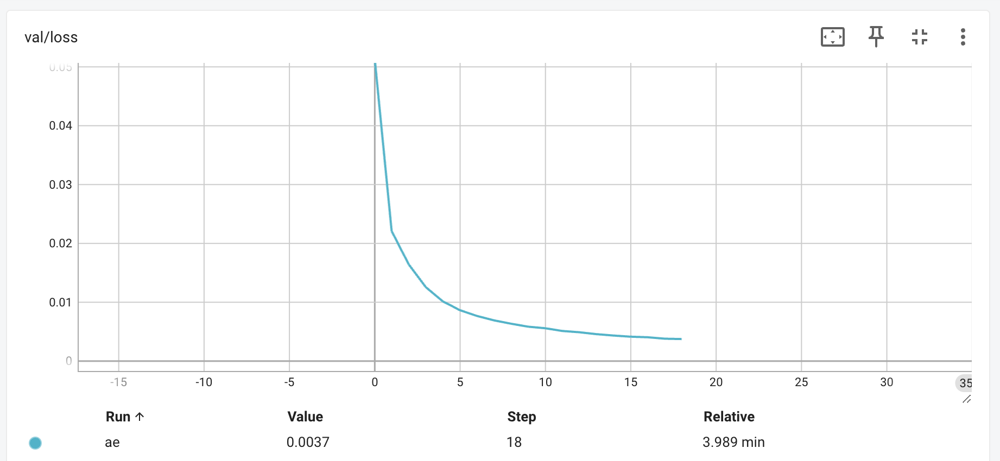
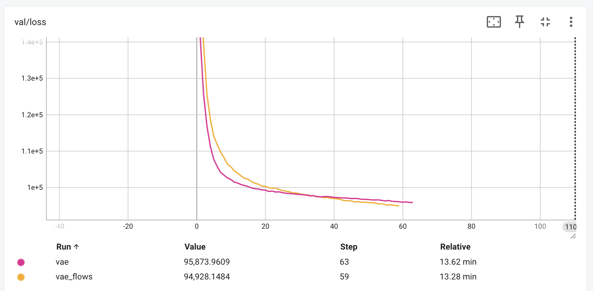
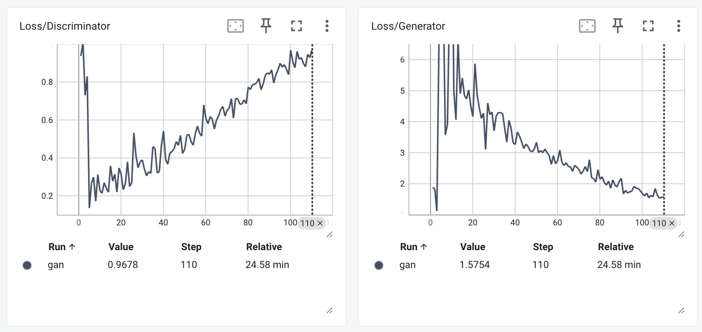
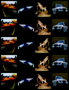
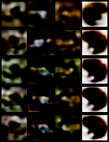
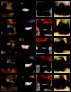
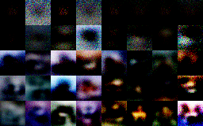

# Generative Models Report

Run tensorboard to view logs in `./logs` directory with `python tensorboard --logdir=./logs`

## Model Architectures

### 1. Autoencoder
The Autoencoder is a simple neural network that learns to encode input data into a compressed representation and then decode it back to the original form. The model consists of:

- **Encoder**: Two convolutional layers (3→16→32 channels) with ReLU activations
- **Decoder**: Two transposed convolutional layers (32→16→3 channels) with ReLU activations (except final Tanh)
- **Loss Function**: Mean squared error between input and reconstruction

This model provides a basic non-variational approach to data compression and reconstruction, serving as our baseline model.

```
Input Image → Conv2d(3→16) → ReLU → Conv2d(16→32) → ReLU → 
             ConvTranspose2d(32→16) → ReLU → ConvTranspose2d(16→3) → Tanh → Output Image
```

### 2. Variational Autoencoder (VAE)
The VAE extends the autoencoder by introducing a probabilistic latent space, which allows for better generalization and sampling capabilities. Key components:

- **Encoder**: Convolutional layers followed by fully connected layers that produce the mean and log-variance of the latent distribution
- **Latent Space**: 128-dimensional Gaussian distribution
- **Decoder**: Fully connected layer followed by transposed convolutional layers to reconstruct the input
- **Loss Function**: Reconstruction loss + KL divergence between latent distribution and prior

The VAE enables not only reconstruction but also generation of new samples by sampling from the latent space.

```
Input → Encoder → mean, log-variance → Sampling → z → Decoder → Output
```

### 3. VAE with Planar Flows
This model enhances the VAE by incorporating normalizing flows to create a more expressive latent space distribution. Details:

- **Base VAE**: Same architecture as the standard VAE
- **Flow Layers**: 4 planar flow transformations applied to the latent representation
- **Flow Structure**: Each flow applies f(z) = z + u * tanh(w^T z + b) transformation
- **Loss Function**: Modified VAE loss that accounts for the determinant of the flow transformation

Planar flows increase the expressiveness of the posterior distribution, allowing for more complex latent space modeling.

```
Input → Encoder → Mean, Log-Variance → z_0 → Flow_1 → ... → Flow_4 → z_4 → Decoder → Output
```

### 4. Generative Adversarial Network (GAN)
The GAN consists of two competing networks:

- **Generator**: Four-layer fully connected network (input → 256 → 512 → 1024 → output) with LeakyReLU activations
- **Discriminator**: Four-layer fully connected network (input → 1024 → 512 → 256 → 1) with LeakyReLU activations and dropout
- **Training Process**: Alternating optimization between generator and discriminator with binary cross-entropy loss

The GAN learns through adversarial training to generate samples that are indistinguishable from real data.

## Training Process

### AE loss curve



### VAE/Flows loss curves



### Generator/Discriminator loss curves



### Hyperparameter Tuning

For all models, employed the following optimization strategies:

- **Optimizer**: Adam with learning rate 1e-3
- **Batch Size**: Varied between 64 and 128 to balance computational efficiency and gradient stability
- **Epochs**: Training continued until validation loss stabilized

For the VAE models, experimented with:
- **Latent Dimension**: Tested 64, 128, and 256 dimensions
- **KL Weight**: Implemented adaptive weighting to balance reconstruction vs. regularization

For the GAN:
- **Discriminator Learning Rate**: Slightly higher than Generator (4e-4 vs 1e-4) using Two Time-scale Update Rule (TTUR)
- **Label Smoothing**: Used 0.9 for real labels instead of 1.0

### Adaptive KL Loss Strategies

For VAE and flow-based models, implemented:

1. **KL Annealing**: Gradually increased KL weight from 0 to 1 over the first 10,000 steps
2. **Free Bits**: Set minimum KL contribution per latent dimension to 0.5 to ensure active code usage
3. **Cyclical Annealing**: Employed cyclical KL weight schedule to escape local optima

## Generated Reconstructions (AE, VAE, Norm-VAE)

### Autoencoder


### VAE


### VAE with normalizing flows

## Generated Samples (GAN)



## Conclusion and Future Work

Experiments show that:

1. The base Autoencoder provides good reconstruction but lacks generative capabilities
2. The VAE offers a balance between reconstruction and generation
3. Adding normalizing flows to the VAE improves the expressiveness of the latent space
4. The GAN produces the most visually appealing samples but is the most challenging to train

Future work directions:
- Implement image quality analysis metric
- Explore hierarchical VAE architectures
- Implement more sophisticated flow architectures (RealNVP, IAF)
- Combine VAE and GAN approaches (VAE-GAN)
- Experiment with self-attention mechanisms in all models